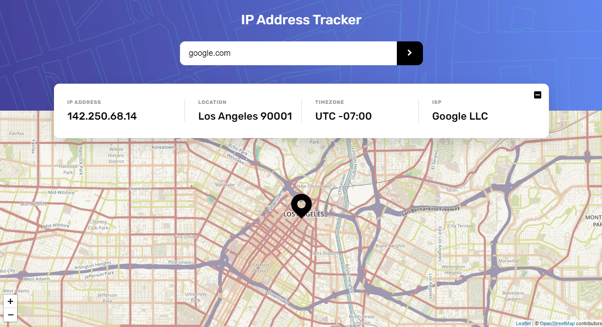

# Frontend Mentor - IP address tracker

This is a solution to the [IP address tracker challenge on Frontend Mentor](https://www.frontendmentor.io/challenges/ip-address-tracker-I8-0yYAH0). Frontend Mentor challenges help you improve your coding skills by building realistic projects.

[LIVE SITE URL](https://ip-address-tracker-paulcave.netlify.app/)

I learned a lot doing this challenge. It is the first API/Async project I've built outside a course, as well as the first time using environment variables + Netlify functions.

### Features

- When opening the site, the map view flies to the location of your current IP address.
- You can search for IP addresses and domains.
- The input is validated with against regex and an error shown if the format does not match.
- While fetching data, a loading animation is shown in the info panel. The info panel can also be collapsed.
- The site is fully responsive for all screens.

### Built with

- SCSS
- Flexbox
- Desktop-first
- Vanilla JavaScript
- [LeafletJS library](https://leafletjs.com/reference-1.7.1.html)
- [IP Geolocation API](https://geo.ipify.org/) - React framework
- [Netlify serverless functions](https://docs.netlify.com/functions/overview/)

### Acknowledgements

I was helped massively by another solution to this challenge: [GitHub](https://github.com/tediko/ip-address-tracker) [Frontendmentor](https://www.frontendmentor.io/solutions/ip-tracker-mobile-first-sass-environment-variable-webpack-js-KVNZjJXr_).
It's where I got the idea for the info collapse button, the loading animation, and using netlify functions to hide the API access key.
Video tutorial he also mentions: [How To Hide API Keys Using Netlify](https://www.youtube.com/watch?v=m2Dr4L_Ab14)
